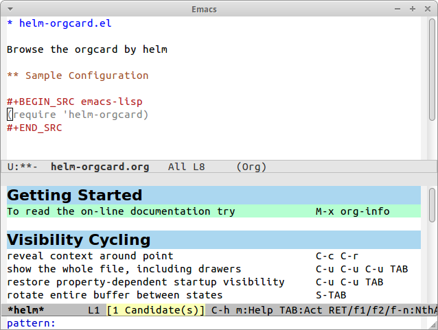

# helm-orgcard.el [![melpa badge][melpa-badge]][melpa-link] [![melpa stable badge][melpa-stable-badge]][melpa-stable-link]

Browse the orgcard by helm.

## Screenshot

## Installation

`helm-orgcard` is available on [MELPA][melpa-link] and [MELPA-STABLE][melpa-stable-link].

You can install `helm-orgcard` with the following command.

<kbd>M-x package-install [RET] helm-orgcard [RET]</kbd>

[melpa-link]: https://melpa.org/#/helm-orgcard
[melpa-stable-link]: https://stable.melpa.org/#/helm-orgcard
[melpa-badge]: https://melpa.org/packages/helm-orgcard-badge.svg
[melpa-stable-badge]: https://stable.melpa.org/packages/helm-orgcard-badge.svg
